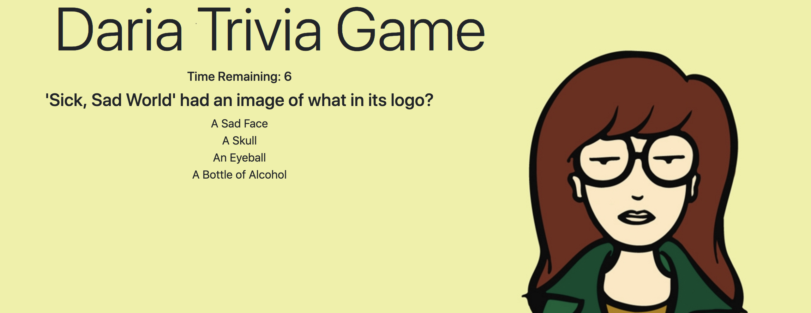

# triviaGame

### About my App:

This app is a timed trivia game over the 90's TV show <em>Daria</em>.  The game reveals only one question at a time.  The player has fiften seconds to answer each question.  Begin by clicking the start button!

### How My App Works:

* When the player selects the correct answer, the game congratulates him/her for choosing the right answer.  After a few seconds, the game goes the next question without any input from the player.
* When the player runs out of time, the game tells the player that time is up and shows the correct answer.  After a few seconds, the game goes the next question without any input from the player.
* When the player chooses the wrong answer, the game tells the player that s/he has selected the wrong answer, and then displays the correct answer.  After a few seconds, the game goes the next question without any input from the player.
* At the end, the game reveals the player's score sheet: the number of questions answer correctly, incorrectly, or not at all.
* Finally the player has the option to play again by clicking the the Play
Again button.

### Technologies Used for this App:

* Bootstrap,
* JavaScript, and
* jQuery.

### Thank you for visiting my github!

Enjoy using my app here: https://lucyq19.github.io/triviaGame/

If you like this app, you may enjoy using more of my apps here: https://lucyq19.github.io/professionalPortfolio/
